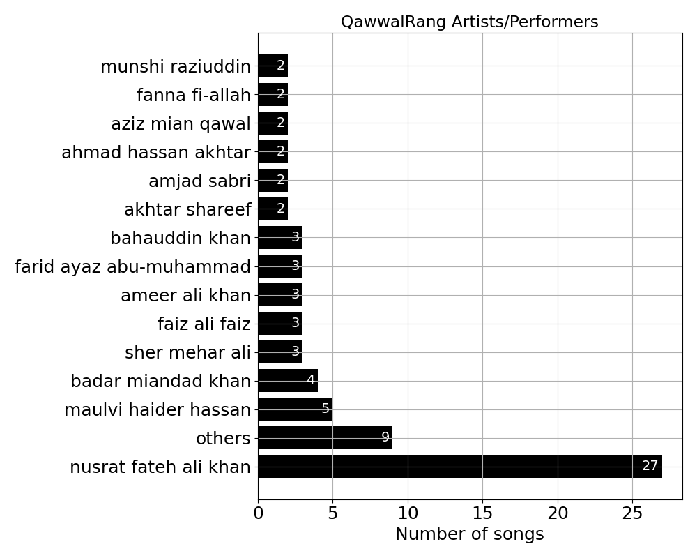
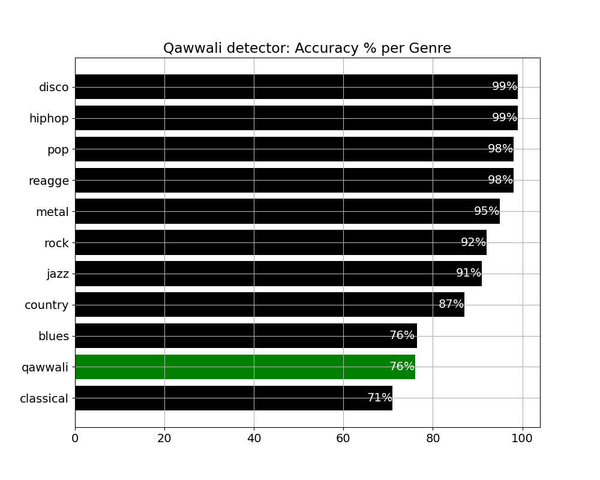

# QawwalRang
An audio dataset for genre recognition of Qawwali

# Contents

- data: Collection of 72 one-minutes duration [Qawwali](https://www.britannica.com/art/qawwali) [songs](blob/data/qawwalrang.tar.bz2). Format is mono with sample rate 44100 Hz
- metadata: JSON formatted schema and metadata file describing QawwalRang dataset: song name, artist, URL, offset and duration
- src: Two python3 programs one to (rebuild) dataset from metadata file and another program attempting to recognize Qawwali as genre of a given song.
- article: Documentation with motivation, description and results from this work

# Dependencies

- [librosa](https://librosa.org/)
- [lmfit](https://lmfit.github.io/lmfit-py/)
- [youtube-dl](https://pypi.org/project/youtube_dl/)
- [gdown](https://pypi.org/project/gdown/)
- [matplot-lib](https://pypi.org/project/matplotlib/)

# Building dataset
```bash
usage: qdsb.py [-h] [--opath OFFLINE_PATH] [--info] datapath metadata

Qawwali dataset builder

positional arguments:
  datapath              Folder/directory path where qawali reference dataset
                        will be built
  metadata              Json metadata file describing reference qawali dataset

optional arguments:
  -h, --help            show this help message and exit
  --opath OFFLINE_PATH  Folder/directory to look for qawali songs. Alternate
                        to internet download
  --info                Asks the program to report dataset statistics
```

# Running classifier
```bash
usage: qdetect.py [-h] [--reload] [--extract]
                  [--compare [genre features directory]]
                  songs_dir

Qawwali genre detection program

positional arguments:
  songs_dir             folder/directory containing songs to be evaluated

optional arguments:
  -h, --help            show this help message and exit
  --reload              reload data from songs (required at least once per
                        songs directory)
  --extract             extract suitable audio features from raw data
                        (required at least once)
  --compare [genre features directory]
                        generates classification results comparing qawali wtih
                        other genre

```

# Results
- Artist Map


- Qawwali recognition against GTZAN [dataset](http://marsyas.info/downloads/datasets.html)

